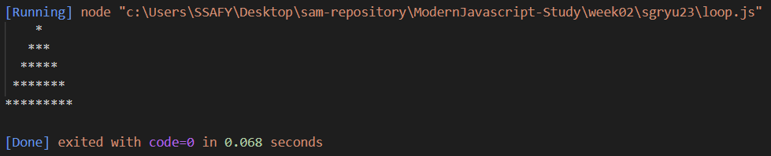
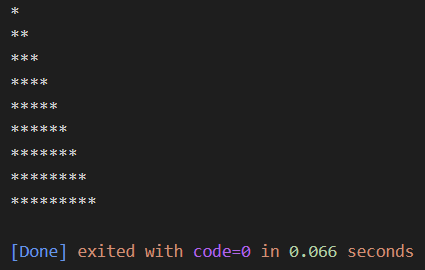

### 반복문
#### 반복문의 동작 방식
  * 조건식의 평가 결과가 참인 경우 코드 블록을 실행한다. (조건식이 거짓일 때까지 반복)
  * 반복문의 종류: for, while, do ... while 문

#### for 문
  * 기본적인 for 문의 동작 방식에 대한 설명은 생략했습니다. (java, python에서 사용되는 방식과 유사)
  * for 문 문법<strong style="color:orange">(javascript 만의 for 문 차이점)</strong>: for (선언문; 조건식; 증감식) { (실행 구문); }
  * 선언문, 조건식, 증감식은 각각 생략 가능(단, 세미클론(;)은 넣어줘야 한다)
  * for 문으로 별찍기 실습(재미로 보는 javascript for 문)
  ```js
  for (let i = 1; i <= 10; i += 2) {
    console.log(" ".repeat((10 - i) / 2) + "*".repeat(i));
  }
  ```
  
  * 이런 방식으로 for 문이 실행된다 정도만 이해하는 용도
  <br>
  * for 문 활용 예시 1: 배열의 요소(값)를 변경하는 경우
  ```js
  let numbers = [1, 2, 3, 4, 5];
  for (let i = 0; i < numbers.length; i++) {
    numbers[i] = numbers[i] * 2  // 배열의 각 요소를 2배로 바꾸어 준다.
  }
  console.log(numbers)  // [2, 4, 6, 8, 10]
  ```
  * for 문 활용 예시 2: 객체의 속성을 순회하는 경우
  ```js
  let student = {
    name: 'John',
    age: 15,
    grade: 10
  };
  for (let key in student) {
    console.log(`${key}: ${student[key]}`);  // 객체의 각 속성 이름과 값
  }
  ```

#### while 문
  * while 문은 반복 횟수가 불명확할 때 사용합니다.
  * 기본적인 while 문법에 대한 이해를 전제하고 활용법을 위주로 정리했습니다. (java, python 등 다른 언어에서 사용하는 것과 동일)

  * while 문 활용 예시: 사용자 입력을 받아 처리하는 경우
  ```js
  let input;
  while (input !== 'quit') {
    input = prompt('Type "quit" to exit.');  // 사용자가 'quit'을 입력할 때까지 계속해서 입력을 요청하는 구문
  }
  ```

  * while 문 활용 예시: 특정 조건을 만족하는 요소를 찾는 경우
  ```js
  let numbers = [1, 2, 3, 4, 5, 6, 7, 8, 9];
  let i = 0;

  while (numbers[i] % 5 !== 0) {
    i++;
  }
  console.log(numbers[i]);  // 출력: 5 (5로 나눴을 때 0이 되는 첫 번째 수를 반환)
  ```

#### do ... while 문
  * 코드 블록을 먼저 실행하고 조건식을 평가한다. 즉, 코드 블록은 무조건 한 번 이상 실행된다.
  ```js
  let i = 1;

  do {
    console.log('*'.repeat(i));
    i += 1;
  } while (i < 10);
  ```
  **[결과]**
  
  * 설명: i === 9 일 때 '*'을 9번 출력하고 i += 1; 을 통해 i === 10이 되었으므로 while문을 탈출한다.
  * 본문을 먼저 실행하고, 조건을 확인한 후에 조건이 truth 인 동안 do {...} 실행문이 계속 실행된다.

#### while vs do ... while
  * 대다수의 상황에서는 while 을 사용한다.
  * 본문을 최소한 한 번이라도 실행하고 싶을 때 do ... while 을 사용한다.