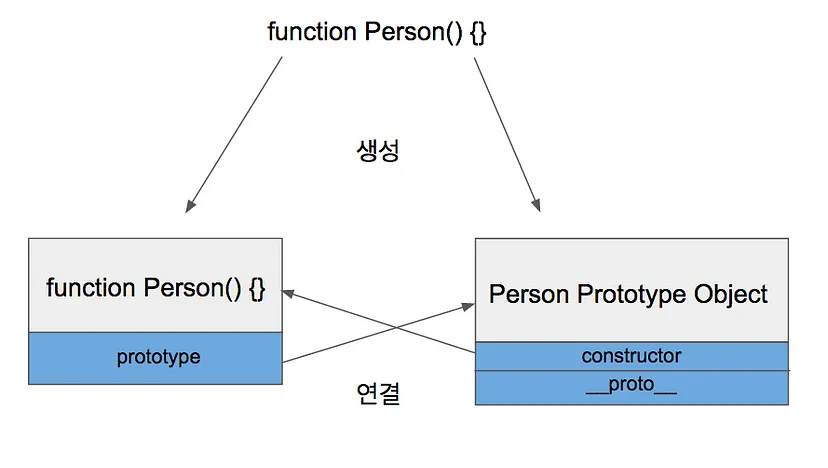
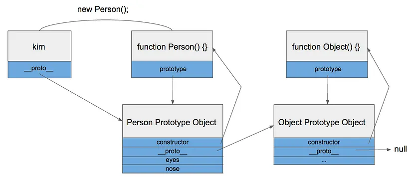
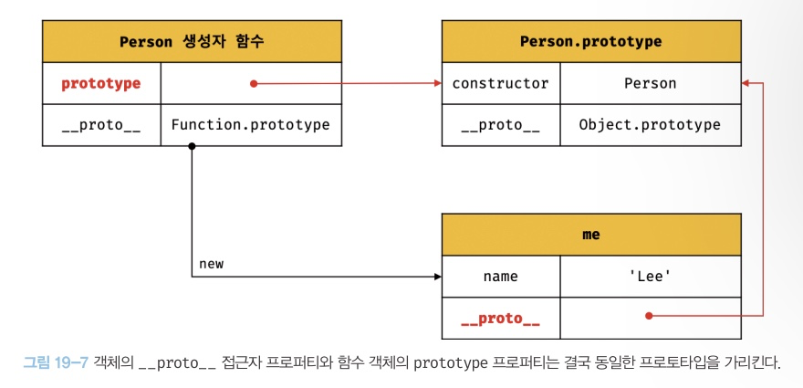

## 19.3 프로토타입 객체

- 자바스크립트는 **프로토타입 기반 언어**라고 불린다.
### Prototype vs Class
- 클래스(Class)는 Java, Python 등의 객체지향언어에서 빠질 수 없는 개념
- 자바스크립트도 객체지향언어지만 클래스라는 개념이 없다. 대신 프로토타입(Prototype)이라는 개념이 존재한다.
- 자바스크립트는 클래스가 없으니 기본적으로 상속 기능도 없다.
  - But ECMA6 표준에서 클래스 문법이 추가되었다.
- 그래서 프로토타입을 기반으로 상속을 흉내내어 구현한다.

```js
function Person() {
    this.eyes = 2;
    this.nose = 1;
}

var kim = new Person();
var park = new Person();

console.log(kim.eyes);  // 2
console.log(kim.nose);  // 1

console.log(park.eyes);  // 2
console.log(park.nose);  // 1
```
- kim과 park는 eyes와 nose를 공통적으로 가지고 있는데 메모리에서는 eyes와 nose가 각 두 개씩(총 4개) 할당된다. 객체가 100개면 200개의 변수가 메모리에 할당됨 -> 메모리를 비효율적으로 사용하는 문제가 발생한다.
- 이런 문제를 아래와 같이 프로토타입으로 해결할 수 있다.
```js
function Person() {}

Person.prototype.eyes = 2;
Person.prototype.nose = 1;

var kim = new Person();
var park = new Person();

console.log(kim.eyes);  // 2
```
- Person.prototype이라는 빈 Object가 존재하고, Person 함수로부터 생성된 객체들(kim, park)은 Object에 들어있는 값을 모두 갖다 쓸 수 있다.
- eyes와 nose를 빈 공간에 넣어놓고 kim과 park이 공유해서 사용한다.

### Prototype Link & Prototype Object
- Prototype에는 Prototype Link와 Prototype Object 개념이 존재한다.

#### Prototype Object
- 객체는 항상 함수(Function)로 생성된다.
```js
function Person() {}  // 함수
var personObject = new Person();  // 함수로 객체를 생성
```
- PersonObject 객체는 Person이라는 함수로 생성된 객체다.
```js
var obj = {};
```
- 이 코드는 함수랑 전혀 상관없어 보이지만 사실은 아래와 같다.
```js
var obj = new Object();
```
- `Object`가 자바스크립트에서 기본적으로 제공하는 함수다.
- `Object`와 마찬가지로 `Function`, `Array`도 모두 함수로 정의되어 있다.

### `Object`가 Prototype Object랑 무슨 상관이 있나요?
- 함수가 정의될 때는 아래 두 가지 일이 동시에 이뤄진다.
1. 해당 함수에 Constructor(생성자) 자격 부여
- Constructor 자격이 부여되면 new를 통해 객체를 만들어 낼 수 있다.
- 이것이 함수만 `new` 키워드를 사용할 수 있는 이유
```js
var obj = {};
console.log(obj);  // undefined
var a = new obj();  // Uncaught TypeError: obj is not a constructor
```
- constructor가 아니기 때문에 `new`를 사용할 수 없다.

2. 해당 함수의 Prototype Object 생성 및 연결
- 함수를 생성하면 함수 + Prototype Object도 같이 생성된다.

- 생성된 함수는 prototype이라는 속성을 통해 Prototype Object에 접근할 수 있다.
- Prototype Object는 일반적인 객체와 같고 기본적인 속성으로 `constructor`, `__proto__`를 가지고 있다.
- `constructor`는 Prototype Object와 같이 생성되었던 함수를 가리키고 있다.
- `__proto__`는 Prototype Link이다.
- 위에서 kim, park이 나왔던 예제를 다시 보자.
```js
function Person() {}

Person.prototype.eyes = 2;
Person.prototype.nose = 1;

var kim = new Person();
var park = new Person();

console.log(kim.eyes);  // 2
```
- Person.prototype을 사용하는 이유: Prototype Object는 일반적인 객체이므로 속성을 마음대로 추가 or 삭제할 수 있다
- kim과 park는 Person 함수를 통해 생성되었으므로 Person.prototype을 참조할 수 있다.

### Prototype Link
- kim에는 eyes라는 속성이 없는데도 kim.eyes를 실행하면 2라는 값을 출력한다.
- Prototype Object에 존재하는 eyes 속성을 어떻게 해서 참조한 것일까?
- kim이 가지고 있는 딱 하나의 속성 `__proto__`가 그것을 가능하게 해준다.
- prototype 속성은 함수만 가지고 있는 것과 달리 `__proto__` 속성은 모든 객체가 빠짐없이 가지고 있는 속성이다.
- `__proto__`는 객체가 생성될 때 조상이었던 함수의 Prototype Object를 가리킨다.
- kim 객체는 Person 함수로부터 생성되었으니 Person 함수의 Prototype Object를 가리키고 있다.
- `__proto__`는 Person 함수의 Prototype Object를 가리키고 있다.

- kim 객체가 eyes를 직접 가지고 있지 않기 때문에 eyes 속성을 찾을 때까지 상위 프로토타입을 탐색한다.
- 최상위인 Object의 Prototype Object까지 도달했는데도 못 찾았을 경우 undefined를 리턴한다.
- 이런 식으로 `__proto__` 속성을 통해 상위 프로토타입과 연결되어 있는 형태를 프로토타입 체인(Chain)이라고 한다.


- 위와 같은 프로토타입 체인 구조 때문에 모든 객체는 Object의 자식이라 불리고 Object Prototype Object에 있는 모든 속성을 사용할 수 있다.

- 프로토타입은 어떤 객체의 상위(부모) 객체 역할을 하는 객체로서 다른 객체에 공유 프로퍼티(메서드 포함)을 제공한다. 프로토타입을 상속 받은 하위(자식) 객체는 상위 객체의 프로퍼티를 자신의 프로퍼티처럼 자유롭게 사용할 수 있다.
- 모든 객체는 [[Prototype]]이라는 내부 슬롯을 가지며, 이 내부 슬롯의 값은 프로토타입의 참조다.
- [[Prototype]]에 저장되는 프로토타입은 객체 생성 방식에 의해 결정된다. 즉, 객체가 생성될 때 객체 생성 방식에 따라 프로토타입이 결정되고 [[Prototype]]에 저장된다.
- 모든 객체는 하나의 프로토타입을 갖는다. 그리고 모든 프로토타입은 생성자 함수와 연결되어 있다.
- [[Prototype]] 내부 슬롯에는 직접 접근할 수 없지만, `__proto__` 접근자를 통해 내부 슬롯이 가리키는 프로토타입에 간접적으로 접근할 수 있다.
- 그리고 프로토타입은 자신의 constructor 프로퍼티를 통해 생성자 함수에 접근할 수 있고, 생성자 함수는 자신의 prototype 프로퍼티를 통해 프로토타입에 접근할 수 있다.

#### `__proto__` 접근자 프로퍼티를 코드 내에서 직접 사용하는 것은 권장하지 않는다.

- 다음과 같이 Object.prototype을 상속받지 않는 객체를 생성할 수도 있기 때문에 `__proto__` 접근자 프로퍼티를 사용할 수 없는 경우가 있다.

```js
// obj는 프로토타입 체인의 종점이다. 따라서 Object.__proto__를 상속받을 수 없다.
const obj = Object.create(null);

// obj는 Object.__proto__를 상속받을 수 없다.
console.log(obj.__proto__); // undefined

// 따라서 Object.getPrototypeOf 메서드를 사용하는 편이 좋다.
console.log(Object.getPrototypeOf(obj)); // null
```

- 따라서 `__proto__` 접근자 프로퍼티 대신 프로토타입의 참조를 취득하고 싶은 경우에는 Object.getPrototypeOf 메서드를 사용하고, 프로토타입을 교체하고 싶은 경우에는 Object.setPrototypeOf 메서드를 사용할 것을 권장한다.

```js
const obj = {};
const parent = { x: 1 };

// obj 객체의 프로토타입을 취득
Object.getPrototypeOf(obj); // obj.__proto__;
// obj 객체의 프로토타입을 교체
Object.setPrototypeOf(obj, parent); // obj.__proto__ = parent;

console.log(obj.x); // 1
```

- **모든 객체가 가지고 있는 `__proto__` 접근자 프로퍼티와 함수 객체만이 가지고 있는 prototype 프로퍼티는 결국 동일한 프로토타입을 가리킨다.**
- 하지만 이들 프로퍼티를 사용하는 주체가 다르다.



⭐⭐⭐ `__proto__` 접근자 프로퍼티와 함수 객체의 `prototype` 프로퍼티 정리
|            구분             |    소유     |        값         |  사용 주체  |                                  사용 목적                                   |
| :-------------------------: | :---------: | :---------------: | :---------: | :--------------------------------------------------------------------------: |
| `__proto__` 접근자 프로퍼티 |  모든 객체  | 프로토타입의 참조 |  모든 객체  |           객체가 지신의 프로토타입에 접근 또는 교체하기 위해 사용            |
|     prototype 프로퍼티      | constructor | 프로토타입의 참조 | 생성자 함수 | 생성자 함수가 자신이 생성할 객체(인스턴스)의 프로토타입을 할당하기 위해 사용 |

- 생성자 함수로 객체를 생성한 후 `__proto__` 접근자 프로퍼티와 prototype 프로퍼티로 프로토타입 객체에 접근한 예시이다.

```js
// 생성자 함수
function Person(name) {
  this.name = name;
}

const me = new Person("Lee");

// 결국 Person.prototype과 me.__proto__는 결국 동일한 프로토타입을 가리킨다.
console.log(Person.prototype === me.__proto__); // true
```

- 위 예제에서 Person 생성자 함수는 me 객체를 생성했다.
- me 객체에는 constuctor 프로퍼티가 없지만 me 객체의 프로토타입인 Person.prototype에는 constructor 프로퍼티가 있다.
- 따라서 me 객체는 프로토타입인 Person.prototype의 constructor 프로퍼티를 상속받아 사용할 수 있다.


### 참고 링크
---
1. [JavaScript: 프로토타입의 이해](https://www.nextree.co.kr/p7323/)
2. [Javascript 프로토타입 이해하기](https://medium.com/@bluesh55/javascript-prototype-%EC%9D%B4%ED%95%B4%ED%95%98%EA%B8%B0-f8e67c286b67)