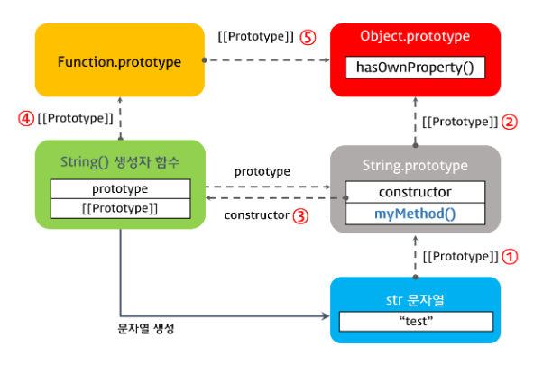

## 원시값과 래퍼 객체
  * 원시 타입: 숫자, 문자열, boolean, null, undefined
  * 래퍼(Wrapper) 객체는 String, Number, Boolean이 있다.
  * 문자열, 숫자, 불리언 등의 원시값이 있는데도 각각을 생성하는 표준 빌트인 생성자 함수가 존재하는 이유?

  ```js
  const str = 'hello';

  console.log(str.length);         // 5
  console.log(str.toUpperCase());  // HELLO
  ```

  * 원시값인 문자열, 숫자, 불리언의 경우 객체처럼 마침표 표기법(또는 대괄호 표기법)으로 접근하면 자바스크립트 엔진이 일시적으로 원시값을 연관된 객체로 변환해준다.
  * 문자열, 숫자, 불리언 값에 대해 객체처럼 접근하면 생성되는 임시 객체를 **래퍼 객체(Wrapper Object)**라고 한다.

  ```js
  const str = 'hello';
  console.log(typeof str);                  // string
  console.log(str.constructor === String);  // true
  console.dir(str);                         // hello

  const strObj = new String('aloha');
  console.log(typeof strObj);                   // object
  console.log(strObj.constructore === String);  // true
  console.log(strObj);                          // {0: "h", 1: "e", 2: "l", 3: "l", 4: "o", length: 5, __proto__: String, [[PrimitiveValue]]: "hello"}

  console.log(str.toUpperCase());     // HELLO
  console.log(strObj.toUpperCase());  // HELLO
  ```

  * 위 예시에서 원시 타입 문자열과 String() 생성자 함수로 생성한 문자열 객체 타입은 분명히 다르다.(string, object) 원시타입은 객체가 아니므로 프로퍼티나 메서드를 가질 수 없다.
  * 하지만 원시 타입으로 프로퍼티나 메서드를 호출할 때 원시 타입과 연관된 객체로 일시적으로 변환되어 프로토 타입 객체를 공유하게 된다.

  * 원시 타입은 객체가 아니므로 프로퍼티나 메서드를 직접 추가할 수 없다. (아래 예시 참고)
  
  ```js
  const str = 'hello';

  // 에러가 발생하지 않는다.
  str.myMethod = function () {
    console.log('str.myMethod');
  };

  str.myMethod();   // Uncaught TypeError: str.myMethod is not a function
  ```

  * 하지만 String 객체의 프로토타입 객체 String.prototype에 메소드를 추가하면 원시 타입, 객체 모두 메서드를 사용할 수 있다.

  ```js
  const str = 'hello';

  String.prototype.myMethod = function () {
    return 'myMethod';
  };

  console.log(str.myMethod());       // myMethod
  console.log('string'.myMethod());  // myMethod
  console.dir(String.prototype);
  ```

  * 모든 객체는 프로토타입 체인에 의해 Object.prototype 객체의 메서드를 사용할 수 있다.
  * Object.prototype 객체는 프로토타입 체인의 종점으로 모든 객체가 사용할 수 있는 메서드를 갖는다.
  * 자바스크립트는 표준 내장 객체의 프로토타입 객체에 개발자가 정의한 메서드의 추가를 허용한다.

  ```js
  const str = 'hello';

  String.prototype.myMethod = function() {
    return 'myMethod';
  }

  console.log(str.myMethod());
  console.log(String.prototype);

  console.log(str.__proto__ === String.prototype);                 // true
  console.log(String.prototype.__proto__ === Object.prototype);    // true
  console.log(String.prototype.constructor === String);            // true
  console.log(String.__proto__ === Function.prototype);            // true
  console.log(Function.prototype.__proto__ === Object.prototype);  // true
  ```

  

  ```js
  const str = 'hi';

  console.log(str.length);  // 2
  console.log(str.toUpperCase())  // HI

  // 래퍼 객체로 프로퍼티에 접근하거나 메서드를 호출한 후 원시값으로 되돌린다.
  console.log(typeof str);  // string
  ```

  * 위 예시에서 문자열 객체인 String 생성자 함수의 인스턴스는 String.prototype의 메서드를 상속받아 사용할 수 있다.
  * 그 후 래퍼 객체의 처리가 종료되면 래퍼 객체의 [[StringData]] 내부 슬롯에 할당된 원시값으로 원래의 상태, 즉 식별자가 원시값을 갖도록 되돌리고 래퍼 객체는 가비지 컬렉션의 대상이 된다. (아래 코드로 설명)

  ```js
  // 1. 식별자 str은 문자열을 값으로 가지고 있다.
  const str = 'hello';

  // 2. 식별자 str은 암묵적으로 생성된 래퍼 객체를 가리킨다.
  // 식별자 str의 값 'hello'는 래퍼 객체의 [[StringData]] 내부 슬롯에 할당된다.
  // 래퍼 객체에 name 프로퍼티가 동적 추가된다.
  str.name = 'Lee';

  // 3. 식별자 str은 다시 원래의 문자열, 즉 래퍼 객체의 [[StringData]] 내부 슬롯에 할당된 원시값을 갖는다.
  // 2에서 생성한 래퍼 객체는 아무도 참조하지 않는 상태이므로 가비지 컬렉션의 대상이 된다.
  // 4. 식별자 str은 새롭게 암묵적으로 생성된(2에서 생성된 객체와 다른) 래퍼 객체를 가리킨다.
  // 새롭게 생성된 래퍼 객체에는 name 프로퍼티가 존재하지 않는다.
  console.log(str.name);  // undefined

  // 5. 식별자  str은 다시 원래의 문자열, 즉 래퍼 객체의 [[StringData]] 내부 슬롯에 할당된 원시값을 갖는다.
  // 이때 4에서 생성된 래퍼 객체는 아무도 참조하지 않는 대상이므로 가비지 컬렉션의 대상이 된다.
  console.log(typeof str, str);  // string hello
  ```

  * 숫자 값도 마찬가지다.
  ```js
  const num = 1.5;

  // 원시 타입인 숫자가 래퍼 객체인 Number 객체로 변환된다.
  console.log(num.toFixed());  // 2

  // 래퍼 객체로 프로퍼티에 접근하거나 메서드를 호출한 후 다시 원시값으로 되돌린다.
  console.log(typeof num, num);  // number 1.5
  ```

  * boolean 값에 대해서는 메서드를 호출하는 경우는 그다지 없으므로 넘어간다.

  * 참고: [원시 타입의 확장](https://poiemaweb.com/js-prototype#6-%EC%9B%90%EC%8B%9C-%ED%83%80%EC%9E%85primitive-data-type%EC%9D%98-%ED%99%95%EC%9E%A5)